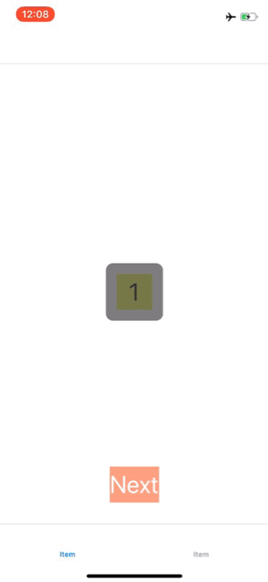

# TDSwiftActivityIndicator
* When presenting, if indicator visible, user interactions will be blocked.
* When presenting, if presented view controller not visible, user interactions will not be affected. When presented view controller being moved to front, user interactions will be blocked.

  

